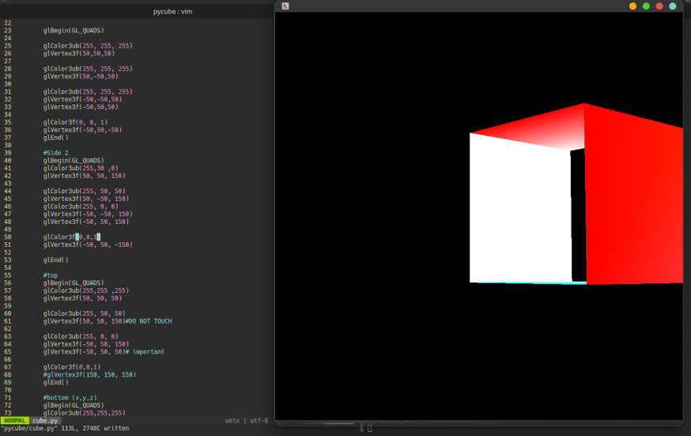

# Pyglet cube test

Use the arrow keys to move the viewport around
# How to run

`pip install -r requirements.txt`

`py pycube`

OR

`make install` and `make run`

## warning

Spaghetti code incoming
